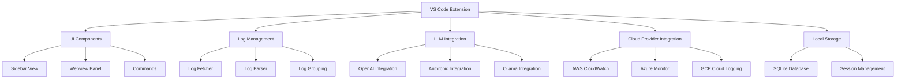
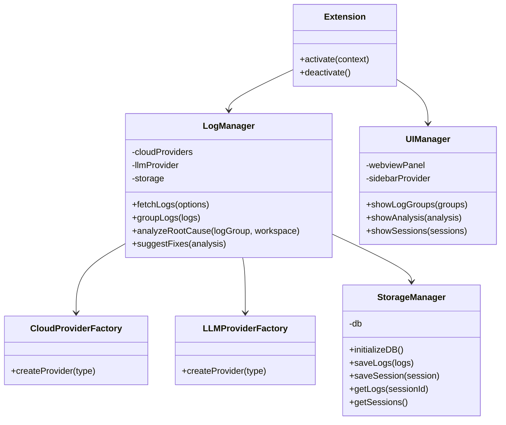
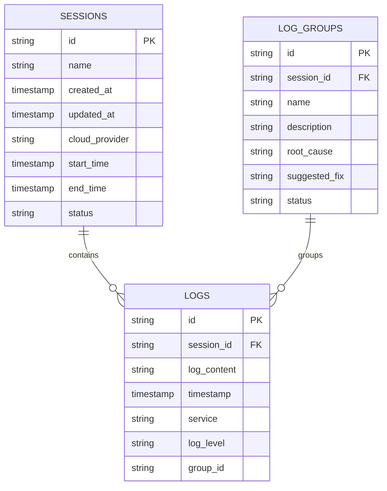

# Rootsy Extension: Detailed Implementation Plan

This document outlines a comprehensive plan for implementing the Rootsy extension that helps developers analyze logs from cloud providers and identify root causes of issues.

## 1. Architecture Overview



## 2. Core Components

### 2.1 Extension Structure



### 2.2 Database Schema



## 3. Implementation Phases

### Phase 1: Core Infrastructure and UI Setup

1. **Set up project structure**

   - Organize code into modules (UI, log management, cloud providers, LLM integration)
   - Configure TypeScript and linting

2. **Implement SQLite storage**

   - Create database schema for logs and debugging sessions
   - Implement storage manager for CRUD operations

3. **Create basic UI components**

   - Update sidebar view with buttons for error logs and all logs
   - Create webview panel for displaying logs and analysis
   - Implement basic UI for log groups as expandable boxes

4. **Implement cloud provider integrations**
   - AWS CloudWatch Logs integration
   - Azure Monitor/Application Insights integration
   - Google Cloud Logging integration
   - Abstract common functionality into base classes

### Phase 2: Log Management and Analysis

1. **Implement log fetching**

   - Fetch logs from configured cloud provider
   - Support filtering by time range (default 2 days)
   - Support filtering for error logs only

2. **Implement log parsing**

   - Parse different log formats (JSON, plain text, structured)
   - Extract key information (timestamp, log level, message, service)

3. **Implement LLM integration**

   - Connect to configured LLM provider (OpenAI, Anthropic, Ollama)
   - Create prompts for log analysis tasks

4. **Implement log grouping**
   - Use LLM to group related logs
   - Store grouped logs in the database
   - Display grouped logs in the UI

### Phase 3: Root Cause Analysis and Debugging Sessions

1. **Implement root cause analysis**

   - Analyze log groups to identify potential root causes
   - Scan workspace code to find relevant files and lines
   - Generate explanations of what might be causing errors

2. **Implement fix suggestions**

   - Generate potential fixes based on the code in the workspace
   - Display suggestions in the UI

3. **Implement debugging sessions**

   - Create, save, and load debugging sessions
   - Track progress within sessions
   - Allow adding notes and marking issues as resolved

4. **Implement additional log fetching**
   - Add ability to fetch more logs based on initial analysis
   - Refine log groups with new information

### Phase 4: Refinement and Advanced Features

1. **Improve UI and UX**

   - Enhance visualization of log groups
   - Add progress indicators for long-running operations
   - Implement keyboard shortcuts

2. **Add customization options**

   - Custom time ranges for log fetching
   - Filtering options for logs
   - Customizable LLM prompts

3. **Implement performance optimizations**

   - Efficient log storage and retrieval
   - Caching of analysis results
   - Pagination for large log sets

4. **Add advanced features**
   - Inline code annotations (future enhancement)
   - Integration with VS Code's problems panel
   - Export/import of debugging sessions

## 4. Detailed Component Specifications

### 4.1 Cloud Provider Integration

Each cloud provider integration will:

- Connect to the provider's API using the configured credentials
- Fetch logs based on specified filters (time range, log level)
- Transform logs into a common format for processing
- Support pagination for large log sets

### 4.2 LLM Integration

The LLM integration will:

- Connect to the configured LLM provider
- Create specialized prompts for:
  - Log grouping
  - Root cause analysis
  - Code analysis
  - Fix suggestion
- Handle rate limiting and token usage
- Cache results to minimize API calls

### 4.3 Log Management

The log management system will:

- Coordinate between cloud providers and LLM
- Store logs in the SQLite database
- Implement algorithms for initial log filtering
- Manage log groups and their relationships

### 4.4 UI Components

The UI will consist of:

- Sidebar view with buttons for main actions
- Webview panel for displaying logs and analysis
- Log group visualization with expandable boxes
- Root cause analysis view
- Debugging session management interface

### 4.5 Storage System

The SQLite storage will:

- Store logs efficiently with indexing
- Manage debugging sessions
- Support querying logs by various criteria
- Handle large volumes of log data

## 5. File Structure

```
rootsy/
├── package.json
├── tsconfig.json
├── .vscodeignore
├── resources/
│   └── rootsy.svg
├── src/
│   ├── extension.ts                  # Main extension entry point
│   ├── ui/
│   │   ├── sidebar.ts                # Sidebar view provider
│   │   ├── webview.ts                # Webview panel manager
│   │   ├── logGroupView.ts           # Log group visualization
│   │   └── analysisView.ts           # Analysis results view
│   ├── log/
│   │   ├── logManager.ts             # Main log management
│   │   ├── logParser.ts              # Log parsing utilities
│   │   ├── logGrouper.ts             # Log grouping with LLM
│   │   └── logAnalyzer.ts            # Root cause analysis
│   ├── cloud/
│   │   ├── cloudProviderFactory.ts   # Factory for cloud providers
│   │   ├── baseCloudProvider.ts      # Base class for providers
│   │   ├── awsProvider.ts            # AWS CloudWatch integration
│   │   ├── azureProvider.ts          # Azure Monitor integration
│   │   └── gcpProvider.ts            # GCP Cloud Logging integration
│   ├── llm/
│   │   ├── llmProviderFactory.ts     # Factory for LLM providers
│   │   ├── baseLlmProvider.ts        # Base class for LLM providers
│   │   ├── openaiProvider.ts         # OpenAI integration
│   │   ├── anthropicProvider.ts      # Anthropic integration
│   │   ├── ollamaProvider.ts         # Ollama integration
│   │   └── prompts.ts                # LLM prompt templates
│   ├── storage/
│   │   ├── storageManager.ts         # Main storage manager
│   │   ├── database.ts               # SQLite database setup
│   │   ├── sessionStorage.ts         # Debugging session storage
│   │   └── logStorage.ts             # Log storage
│   └── utils/
│       ├── config.ts                 # Configuration utilities
│       ├── logger.ts                 # Extension logging
│       └── helpers.ts                # Misc helper functions
└── media/                            # Media for README
```

## 6. Implementation Details

### 6.1 Commands to Implement

```typescript
// Main commands
"rootsy.pullErrorLogs"; // Pull only error logs
"rootsy.pullAllLogs"; // Pull all logs
"rootsy.analyzeRootCause"; // Analyze selected log group
"rootsy.fetchMoreLogs"; // Fetch additional logs
"rootsy.createSession"; // Create new debugging session
"rootsy.loadSession"; // Load existing debugging session
"rootsy.saveSession"; // Save current debugging session
```

### 6.2 Configuration Settings to Add

```json
"rootsy.logs.defaultLookbackDays": {
  "type": "number",
  "default": 2,
  "description": "Default number of days to look back for logs"
},
"rootsy.logs.maxLogsPerFetch": {
  "type": "number",
  "default": 1000,
  "description": "Maximum number of logs to fetch in a single request"
},
"rootsy.llm.maxTokens": {
  "type": "number",
  "default": 4000,
  "description": "Maximum tokens to use for LLM requests"
},
"rootsy.storage.maxSessionsToKeep": {
  "type": "number",
  "default": 10,
  "description": "Maximum number of debugging sessions to keep"
}
```

### 6.3 Database Initialization

```typescript
// Example of database initialization
async function initializeDatabase(): Promise<Database> {
  const db = new sqlite3.Database(
    path.join(context.globalStoragePath, "rootsy.db")
  );

  // Create sessions table
  await db.exec(`
    CREATE TABLE IF NOT EXISTS sessions (
      id TEXT PRIMARY KEY,
      name TEXT NOT NULL,
      created_at INTEGER NOT NULL,
      updated_at INTEGER NOT NULL,
      cloud_provider TEXT NOT NULL,
      start_time INTEGER NOT NULL,
      end_time INTEGER NOT NULL,
      status TEXT NOT NULL
    )
  `);

  // Create logs table
  await db.exec(`
    CREATE TABLE IF NOT EXISTS logs (
      id TEXT PRIMARY KEY,
      session_id TEXT NOT NULL,
      log_content TEXT NOT NULL,
      timestamp INTEGER NOT NULL,
      service TEXT,
      log_level TEXT,
      group_id TEXT,
      FOREIGN KEY (session_id) REFERENCES sessions (id)
    )
  `);

  // Create log_groups table
  await db.exec(`
    CREATE TABLE IF NOT EXISTS log_groups (
      id TEXT PRIMARY KEY,
      session_id TEXT NOT NULL,
      name TEXT NOT NULL,
      description TEXT,
      root_cause TEXT,
      suggested_fix TEXT,
      status TEXT NOT NULL,
      FOREIGN KEY (session_id) REFERENCES sessions (id)
    )
  `);

  return db;
}
```

### 6.4 Log Fetching Example

```typescript
// Example of fetching logs from AWS CloudWatch
async function fetchAwsLogs(options: LogFetchOptions): Promise<Log[]> {
  const { startTime, endTime, logLevel, maxLogs } = options;

  const cloudwatchlogs = new AWS.CloudWatchLogs({
    region: config.get("rootsy.aws.region"),
    credentials: {
      accessKeyId: config.get("rootsy.aws.accessKeyId"),
      secretAccessKey: config.get("rootsy.aws.secretAccessKey"),
    },
  });

  // Build filter pattern based on log level
  let filterPattern = "";
  if (logLevel === "error") {
    filterPattern = "?ERROR ?Error ?error ?EXCEPTION ?Exception ?exception";
  }

  // Get log groups
  const logGroups = await cloudwatchlogs.describeLogGroups().promise();

  // Fetch logs from each group
  const allLogs: Log[] = [];
  for (const group of logGroups.logGroups || []) {
    if (!group.logGroupName) continue;

    const params = {
      logGroupName: group.logGroupName,
      startTime: startTime.getTime(),
      endTime: endTime.getTime(),
      filterPattern,
      limit: maxLogs,
    };

    const response = await cloudwatchlogs.filterLogEvents(params).promise();

    // Transform to common log format
    const logs = (response.events || []).map((event) => ({
      id: event.eventId || uuidv4(),
      timestamp: event.timestamp || 0,
      message: event.message || "",
      logStream: event.logStreamName || "",
      logGroup: group.logGroupName || "",
    }));

    allLogs.push(...logs);

    if (allLogs.length >= maxLogs) break;
  }

  return allLogs;
}
```

### 6.5 LLM Integration for Log Grouping

```typescript
// Example of using LLM to group logs
async function groupLogsWithLLM(logs: Log[]): Promise<LogGroup[]> {
  const llmProvider = getLlmProvider();

  // Prepare logs for LLM
  const logsForLLM = logs.map((log) => ({
    id: log.id,
    timestamp: new Date(log.timestamp).toISOString(),
    message: log.message,
    logStream: log.logStream,
    logGroup: log.logGroup,
  }));

  // Create prompt for log grouping
  const prompt = `
    You are an expert log analyzer. Below is a list of logs from a cloud application.
    Please group these logs into related sets that might represent the same issue or request.
    For each group, provide:
    1. A name for the group
    2. A brief description of what these logs might represent
    3. The IDs of logs that belong to this group
    
    Logs:
    ${JSON.stringify(logsForLLM, null, 2)}
    
    Respond with a JSON array of groups in this format:
    [
      {
        "name": "Group name",
        "description": "Description of what these logs represent",
        "logIds": ["log-id-1", "log-id-2", ...]
      }
    ]
  `;

  // Call LLM
  const response = await llmProvider.complete(prompt);

  // Parse response
  try {
    const groups: {
      name: string;
      description: string;
      logIds: string[];
    }[] = JSON.parse(response);

    // Transform to LogGroup objects
    return groups.map((group) => ({
      id: uuidv4(),
      name: group.name,
      description: group.description,
      logs: logs.filter((log) => group.logIds.includes(log.id)),
      rootCause: null,
      suggestedFix: null,
      status: "new",
    }));
  } catch (error) {
    console.error("Failed to parse LLM response:", error);
    // Fallback: put all logs in one group
    return [
      {
        id: uuidv4(),
        name: "All Logs",
        description: "All fetched logs",
        logs,
        rootCause: null,
        suggestedFix: null,
        status: "new",
      },
    ];
  }
}
```

### 6.6 Root Cause Analysis

```typescript
// Example of root cause analysis with LLM
async function analyzeRootCause(
  logGroup: LogGroup,
  workspace: vscode.WorkspaceFolder
): Promise<Analysis> {
  const llmProvider = getLlmProvider();

  // Get relevant files from workspace
  const relevantFiles = await findRelevantFiles(logGroup, workspace);

  // Prepare logs for LLM
  const logsForLLM = logGroup.logs.map((log) => ({
    timestamp: new Date(log.timestamp).toISOString(),
    message: log.message,
    logStream: log.logStream,
    logGroup: log.logGroup,
  }));

  // Prepare code snippets for LLM
  const codeSnippets = await Promise.all(
    relevantFiles.map(async (file) => {
      const content = await vscode.workspace.fs.readFile(file);
      return {
        path: vscode.workspace.asRelativePath(file),
        content: Buffer.from(content).toString("utf8"),
      };
    })
  );

  // Create prompt for root cause analysis
  const prompt = `
    You are an expert software debugger. Below are logs from a cloud application that appear to be related to an issue,
    along with relevant code snippets from the application.
    
    Please analyze these logs and code to:
    1. Identify the root cause of the issue
    2. Explain why this is happening
    3. Suggest potential fixes
    4. Identify the specific files and line numbers where the issue might be occurring
    
    Logs:
    ${JSON.stringify(logsForLLM, null, 2)}
    
    Code snippets:
    ${codeSnippets
      .map(
        (snippet) => `File: ${snippet.path}\n\`\`\`\n${snippet.content}\n\`\`\``
      )
      .join("\n\n")}
    
    Respond with a JSON object in this format:
    {
      "rootCause": "Description of the root cause",
      "explanation": "Detailed explanation of why this is happening",
      "suggestedFixes": [
        "Suggestion 1",
        "Suggestion 2"
      ],
      "locations": [
        {
          "file": "path/to/file.js",
          "lineNumber": 42,
          "description": "Description of the issue at this location"
        }
      ]
    }
  `;

  // Call LLM
  const response = await llmProvider.complete(prompt);

  // Parse response
  try {
    const analysis = JSON.parse(response);
    return {
      rootCause: analysis.rootCause,
      explanation: analysis.explanation,
      suggestedFixes: analysis.suggestedFixes,
      locations: analysis.locations,
    };
  } catch (error) {
    console.error("Failed to parse LLM response:", error);
    return {
      rootCause: "Failed to analyze root cause",
      explanation:
        "The analysis failed due to an error in processing the LLM response.",
      suggestedFixes: [],
      locations: [],
    };
  }
}
```

## 7. Next Steps and Timeline

### Immediate Next Steps

1. **Update package.json**

   - Add new commands
   - Add new configuration settings
   - Add required dependencies (sqlite3, AWS SDK, etc.)

2. **Create basic file structure**

   - Set up the directory structure as outlined
   - Create placeholder files for main components

3. **Implement SQLite storage**

   - Set up database schema
   - Implement basic CRUD operations

4. **Update UI components**
   - Enhance sidebar view
   - Create basic webview panel

### Timeline Estimate

- **Phase 1 (Core Infrastructure)**: 2-3 weeks
- **Phase 2 (Log Management)**: 2-3 weeks
- **Phase 3 (Root Cause Analysis)**: 3-4 weeks
- **Phase 4 (Refinement)**: 2-3 weeks

Total estimated time: 9-13 weeks for full implementation

## 8. Potential Challenges and Mitigations

1. **Challenge**: Large log volumes may cause performance issues
   **Mitigation**: Implement pagination, filtering, and efficient storage

2. **Challenge**: LLM API costs may be high with frequent use
   **Mitigation**: Implement caching, optimize prompts, and add usage limits

3. **Challenge**: Different log formats across cloud providers
   **Mitigation**: Create flexible parsers and normalizers for different formats

4. **Challenge**: Accuracy of LLM analysis may vary
   **Mitigation**: Allow user feedback and iterative refinement of prompts

5. **Challenge**: Security concerns with API keys and log data
   **Mitigation**: Store sensitive data securely, implement proper encryption

## 9. Session Management Workflow

Every call to get error logs or get logs should start a new session by default. This serves as a shortcut to create a session and get logs, as getting logs doesn't make sense without a session.

In the webview UI:

1. First show a session selector with a button to create a new session
2. Only when a user is in a session should the "Get Logs" buttons be available
3. Sessions should track all logs, log groups, and analysis results
